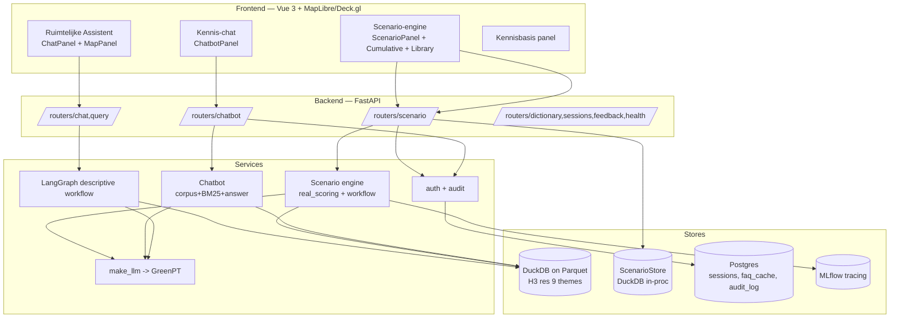
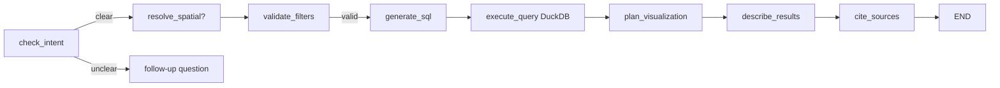

# OneGov #2 — Drinkwaterzekerheid: end-to-end design (v4, current build)

**Status:** reflects the *shipped* build (scenario engine + GreenPT chatbot Phases 1–7,
auth/audit, uncertainty, calibration). **132 backend tests pass**, assumption-source gate green.
**Purpose:** a single document detailed enough to **rebuild this system from scratch**.
Supersedes `onegov2_design_v3_repo_aligned.md` (which described intent; this describes reality).

> Honesty stance carried throughout: where the data or model is approximate, this doc says so
> (saturated `ZOUT_CONC`, CBS density proxy, empty operational tables, "directional" calibration).
> A government tool must be legible about its own limits.

---

## 1. Mission & context

Provincie Zuid-Holland must weigh spatial choices (housing, datacentres, climate shocks)
against **drinking-water security**. The tool answers exploratory *what-if* questions on real
geodata and returns a sourced, reproducible, plain-Dutch verdict that a non-technical policymaker
can defend in an advies.

**Named stakeholders** (from the challenge brief): provincial policymaker, spatial planner /
omgevingsdienst, water authority (Dunea/Evides/Oasen), project developer, citizen.

**Three design pointers** (the spine of every feature):
- 🏚️ **Silo** — one shared truth; stable, shareable, reproducible outputs.
- 🪞 **Consistency** — the same query gives the same answer to everyone.
- 👁️ **Intuition + transparency** — instantly understandable; every output self-explanatory, with sources.

The system has **three query surfaces**, all read-only or whitelist-validated:
1. **Ruimtelijke Assistent** (descriptive) — NL question → SQL over the data → map + explanation.
2. **Scenario-engine** — NL/recipe → assumption-driven H3 DrinkwaterDruk verdict, map, PDF advies.
3. **Kennis-chat** (GreenPT chatbot) — grounded Q&A about the data/method, FAQs, and "explain this scenario".

---

## 2. Architecture



**Stack:** Vue 3 (Vite, MapLibre GL + Deck.gl H3HexagonLayer) · FastAPI + SSE (sse-starlette) ·
LangGraph orchestration · DuckDB querying Parquet (H3 resolution 9) · GreenPT (OpenAI-compatible,
via `app/services/llm.make_llm`) · Postgres (SQLModel + Alembic) for sessions/cache/audit ·
MLflow (skinny) tracing · Python ≥ 3.12.

**Request lifecycles:**
- *Descriptive*: `POST /api/chat` → LangGraph (intent→spatial→validate→SQL→execute→viz→describe→cite_sources) → SSE stream of `text` + `map_data` + `step_thinking_summary` + `sources`.
- *Scenario*: `POST /api/scenario/run` → extract params → score on real H3 data → ScenarioCard → SSE (`scenario_card`, `map_data`, `feasibility_class`, `official_position`, `waterinfo`, `citizen_response`).
- *Chatbot*: `POST /api/chatbot/ask` → intent → retrieve → grounded B1-Dutch answer with citations (or validated scenario run / explain-mode) → SSE.

---

## 3. Data layer

**Source:** the real shipped geodata, all on **H3 resolution-9** cells (~0.1 km²), queried in place
from Parquet via DuckDB (`connect_delta` / `read_parquet`). Themes used by the engine:

| Theme / table | Signal | Notes |
|---|---|---|
| `gebiedsviewer/verzilting` (`ZOUT_CONC`, `RELEVANT`) | salinity pressure | **single saturated class** (`> 200mg/l`) → a *mask*, not a fine value |
| `gebiedsviewer/overstromingen_kwetsbaarheid_panden_na_dijkdoorbraak` (`Risico`) | flood co-pressure | severity map per class |
| `drinkwaterzekerheid/zes_uur_zones_drinkwater` | protection sensitivity | presence ⇒ 1.0 |
| `extra_data/CBS/cbs_vierkantstatistieken_*_consumption` (`aantal_inwoners_sum`) | demand proxy | **downsampled relative density (~46k), not headcounts** |
| `drinkwater_productieketen`, `toestandsbeoordeling_oppervlaktewaterlichamen` | — | **ship empty (0 rows)** — not depended on |

**Honest caveats (must be surfaced, not hidden):**
- Salinity is a saturated single class → modelled as a presence mask amplified by the KNMI dryness knob.
- CBS is a relative density proxy → "demand" is relative, never absolute m³.
- The operational m³/day tables don't exist → all m³/day numbers are *sourced assumptions*, not lookups.
- CBS `h3_index` is a 16-char leading-zero id; the base only `LOWER()`s it (0 overlap) → the engine canonicalises (strip pad zero) recovering 2,145 cells.

**Dataset versioning:** each scenario persists the newest parquet mtime per table; `/verify` reports drift.
**Data dictionary:** `GET /api/dictionary` (theme/table/column metadata from `_llm_metadata_*.json`).
**Knowledge inventory:** `GET /api/kennisbasis` (datasets + publisher links + freshness + column counts).

---

## 4. Trust & safety spine (cross-cutting)

1. **Everything is sourced.** Assumptions carry an http(s) `source_url`; a CI gate
   (`scripts/check_assumption_sources.py`) fails the build if any source is missing/empty.
2. **Determinism tiers** (the consistency pointer):
   - *Hard* — scenario engine: deterministic arithmetic + `scenario_hash` (params+overrides) + cache + dataset-version stamp. Same inputs ⇒ identical verdict.
   - *Strong* — chatbot: GreenPT pinned at **temperature 0**, deterministic BM25 retrieval, a keyless extractive fallback, a versioned answer cache.
   - *Softer* — legacy descriptive prose (generative); structured steps are stable, free prose may vary.
3. **No code/SQL synthesis by the LLM in the scenario path.** The LLM only maps language →
   *validated* `ScenarioParams` + whitelisted assumption overrides; the deterministic engine runs it.
   Out-of-whitelist requests get a clarifying question (no dead ends).
4. **Read-only knowledge.** The chatbot never executes scenarios except through the validated gate.
5. **PII** is anonymised before any user question enters the FAQ cache (postcode/e-mail/phone).
6. **Accountability.** Auth identifies the user; an audit trail records who ran/changed what; the
   identity is stamped into the citation.
7. **Traceability.** In-app reasoning steps (Insight) + sourced citations + MLflow spans + a stable
   shareable URL per scenario.

---

## 5. Backend module map (the buildable backbone)

```
src/backend/app/
  main.py                     FastAPI app; include_router(...); lifespan (mlflow + opt-in PG cache/audit)
  config.py                   Settings (pydantic-settings); all env vars (see §13)
  auth.py                     get_current_user (dev|jwt|header), CurrentUser+roles, require_role
  database.py                 async SQLAlchemy engine (Postgres); make_engine
  routers/
    chat.py                   POST /api/chat — descriptive LangGraph (SSE); CUSTOM_EVENT_TO_SSE map
    query.py                  POST /api/query — one-shot SQL/describe
    dictionary.py             GET /api/dictionary
    sessions.py, feedback.py, health.py    base CRUD/health
    scenario.py               scenario engine endpoints + cumulative/uncertainty/verify/calibration/assumptions/audit/waterinfo
    chatbot.py                chatbot ask/faqs/recipe/kennisbasis + moderation
  services/
    llm.py                    make_llm(model, streaming) -> GreenPT ChatOpenAI
    dictionary_service.py     data dictionary assembly
    data_sources.py           dataset->publisher/URL registry; sources_for_sql; build_kennisbasis
    workflow.py               descriptive LangGraph (8 nodes incl. cite_sources)
    nodes/                    intent, spatial, validate_filters, sql_generation, execute_query,
                              plan_visualization, describe_results, cite_sources, base
    helpers/tables.py         discover_tables, load_theme_metadata, connect_delta
    audit.py / audit_sql.py   AuditEntry + InMemory/SQL stores + record_audit
    scenario/
      models.py               ScenarioParams, ScenarioResults, ReasoningStep, ScenarioCard, ScenarioDelta
      extraction.py           NL -> ScenarioParams (GreenPT temp0 + rule fallback)
      area.py                 select_h3_area (drop-pin grid_disk via PDOK; intake zes-uur zones)
      real_scoring.py         the H3 DrinkwaterDruk score (DEFAULT_ASSUMPTIONS, score_h3_area)
      workflow.py             scenario LangGraph; run_scenario / run_comparison (params, base, tracing)
      chloride.py             per-intake chloride threshold + Drinkwaterbesluit fallback
      demand.py               KNMI presets / demand helpers
      human_scale.py          VEWIN analogies
      interventions.py        intervention catalogue ("make it feasible")
      official_positions.py   official-position registry + disclaimer
      citizen.py              detect_citizen_mode + format_citizen_response
      pdf.py                  build_citation (APA + metadata) + render_scenario_pdf (advies)
      scenario_hash.py        compute_scenario_hash
      scenario_store.py       DuckDB store (set/get/list_recent) + detect_version_drift
      cumulative.py           multi-project + al-vergund stacking
      waterinfo.py            live RWS chloride + dated labelled fallback
      tracing.py              guarded MLflow spans
      uncertainty.py          5-KNMI sweep -> band + verdict distribution
      assumptions.py          ASSUMPTIONS_VERSION + changelog + library + VALIDATION_STATUS
      calibration.py          reference cases + run_calibration + validation_status
    chatbot/
      models.py               Citation, Passage, ChatAnswer, FAQEntry
      text.py                 Dutch tokeniser, stopwords, compound decompounding
      corpus.py               build_corpus (design doc + dictionary + assumptions + FAQ + caveats)
      retrieval.py            BM25Retriever + idf-weighted coverage (confidence gate)
      intents.py              classify_intent
      answer.py               compose_answer (GreenPT temp0 | extractive fallback) + citations
      faq.py                  curated FAQ registry
      faq_cache.py / faq_cache_sql.py   suggestion cache + moderation + PII + InMemory/SQL stores
      scenario_context.py     ScenarioCard -> explain-mode passages
      scenario_run.py         scenario-from-chat validation/whitelist gate + execute
      recipe.py               declarative recipe-builder (validated weights)
  models/                     SQLModel tables: session, feedback, faq_cache, audit
  alembic/                    env.py + versions (faq_cache, audit_log migrations)
  tests_scenario/ tests_chatbot/   132 offline tests
  scripts/check_assumption_sources.py    source gate
```

---

## 6. Descriptive flow — "Ruimtelijke Assistent" (`POST /api/chat`)

An 8-node LangGraph (`app/services/workflow.py`), each node streaming a Dutch
`step_thinking_summary` (the Insight trail):



- LLM (structured output) classifies intent, resolves place names via PDOK, validates categorical
  filters (≤2 correction rounds), generates DuckDB SQL, runs it (materialises a temp table + stats),
  plans the map (colour/height/icon roles → `map_block`), and streams a B1-Dutch description.
- **Phase 5 addition `cite_sources`** (append-only): maps the tables the SQL touched →
  publisher + source URL (`data_sources.sources_for_sql`) → `sources` SSE event, so descriptive
  answers also carry hyperlinked Bronnen.
- SSE events: `meta`, `text`, `map_config`, `map_data`, `step_thinking_summary`, `sources`, `error`, `done`.

---

## 7. Scenario engine — the assumption-driven H3 DrinkwaterDruk model

### 7.1 The score (`real_scoring.score_h3_area`)
Per H3 cell over a chosen universe, the **DrinkwaterDruk** score (0–100):

```
score = 100 · min(1,  w_sal·salinity·dryness
                     + w_flood·flood
                     + w_prot·protection
                     + w_demand·demand_norm )
demand_norm = min(1, pop · per_person_m3day · (1+growth) · (1 + added_homes/regional_households) / demand_ref)
```

**DEFAULT_ASSUMPTIONS (the sourced library, v3.0.0):**
weights salinity/demand/flood/protection = **0.40 / 0.30 / 0.20 / 0.10**;
`knmi_dryness_multiplier` 1.0 (B) … 1.8 (Hd); `demand_per_person_m3_day` 0.119 (VEWIN);
`demand_ref_m3_per_cell` 1.5; `regional_households` 1.7M; verdict thresholds **caution 33, stop 66**;
**area_stop_share 0.20**.

- **salinity** = 1.0 where `RELEVANT='ja'` and `ZOUT_CONC LIKE '%200%'` (saturated mask).
- **flood** from `FLOOD_SEVERITY` map of the `Risico` class.
- **protection** = 1.0 where the cell is in `zes_uur_zones_drinkwater`.
- **demand_norm** from CBS population (relative), with growth + an added-homes lever.
- **dryness** from the KNMI'23 preset (B/Ln/Hn/Ld/Hd).

**Universe (`base`):** `salinity` (verzilting cells, default) or `populated` (CBS built-up cells —
right for demand/housing scenarios). The Phase-4 recipe-builder can force either.

**Verdict:** cell → GO (<33) / CAUTION (33–66) / STOP (≥66). Area → STOP if `stop_share ≥ 0.20`,
else CAUTION if any non-GO cell, else GO.

### 7.2 From question to card
`extraction.extract_scenario_params` (GreenPT temp 0, with a deterministic rule fallback) →
`ScenarioParams`; the LangGraph (`scenario/workflow.py`) runs extract → score → enrich → format:
- **enrich**: ranks interventions ("make it feasible") by STOP-share reduction (re-scoring on real
  data); attaches the official position; computes the human-scale analogy; builds the H3 overlay.
- **format**: assembles `ScenarioCard` with `scenario_hash`, `git_commit`, stable URL,
  `assumptions_version`, `validation_status`.
- Persisted to `ScenarioStore` (DuckDB) with dataset versions; served at a **stable URL**
  `GET /api/scenario/{id}`; exportable as `GET /api/scenario/{id}/citation` (APA + metadata:
  ID, hash, date, software@commit, dataset versions, **Uitgevoerd door**, **Aannameversie**,
  **Validatiestatus**) and `GET /api/scenario/{id}/pdf` (Dutch adviesnota).

### 7.3 Modes & extensions
- **Comparison** (`run_comparison`): with/without shock (default KNMI B vs Hd) + a `ScenarioDelta` narrative.
- **Citizen mode** (`citizen.py`): verdict-first plain Dutch + postcode + water company + official links + disclaimer (`citizen_response` event).
- **Cumulative / "al vergund"** (`cumulative.py`, `POST /api/scenario/cumulative`): stack several
  project demands (homes/datacentre-MW/m³/day → households-equivalent) + an operator-entered committed-
  demand layer; baseline + per-project-alone + combined verdicts; flags the *stapelingseffect*.
  (No permit dataset ships → committed layer is manual entry, labelled.)
- **Live Waterinfo** (`waterinfo.py`): mandatory RWS chloride for IJssel/Lek/Maas intakes; on failure/
  staleness a dated "laatste bekende waarde van [datum]" fallback — never silent. Gated by `WATERINFO_LIVE`.
- **Uncertainty band** (`uncertainty.py`, `POST /api/scenario/uncertainty`): sweeps the five KNMI
  presets → score band + verdict distribution ("STOP in N/5") + robust/knife-edge flag.
- **Assumption versioning** (`assumptions.py`): version + changelog; stamped on card/citation;
  `/verify` reports assumption-version drift. `GET /api/assumptions`.
- **Calibration** (`calibration.py`, `GET /api/scenario/calibration`): runs reference cases
  (IJssel KNMI B→CAUTION ~50, Hd→STOP ~82) and reports agreement; `validation_status` states it is a
  reproducibility/consistency calibration, **not** external validation (pluggable `external-study` slot).

---

## 8. GreenPT knowledge chatbot (Phases 1–7) — `POST /api/chatbot/ask`

**Phase 1 — grounded Dutch Q&A:** a **corpus** (`corpus.py`, ~124 passages) over the v3 design doc,
the data dictionary, the sourced assumptions, the curated FAQs, and **6 first-class data-caveat
passages**. A pure-Python **BM25 retriever** (`retrieval.py`) with a Dutch stopword list +
**compound decompounding** (so `drinkwaterzekerheid` matches `drinkwater`/`zekerheid`) and an
**idf-weighted coverage** confidence gate (threshold 0.34; below ⇒ a clarifying question). The
**answer composer** (`answer.py`) uses GreenPT at temperature 0 when a key/factory is present, else a
**deterministic extractive fallback**, and *always* returns citations. A **data-limits intent**
foregrounds the honest caveats. Curated **FAQ** registry (`faq.py`, 10 entries).

**Phase 2 — scenario-from-chat** (`scenario_run.py`): a **validation/whitelist gate** — allowed
scenario types, KNMI/growth presets, a fixed lever-key set, known intakes, sane horizon, min
confidence. Valid ⇒ run via the engine (streaming the same scenario events); invalid/ambiguous ⇒
clarifying question. The LLM never writes code/SQL.

**Phase 3 — FAQ caching + ranking + moderation** (`faq_cache.py`): confident, cited answers are
cached as **suggestions** (PII anonymised, version-stamped); `GET /api/chatbot/faqs` merges curated +
published (ranked by hits); moderation (`/faqs/suggested`, promote/reject) is **admin-only** with a
grounded-with-sources re-check; stale-stamp entries are filtered (drift invalidation). In-memory
default + Postgres adapter.

**Phase 4 — recipe-builder** (`recipe.py`): a declarative recipe = the four signal weights (must sum
to 1) + presets + base + optional area; validated, mapped to assumption overrides, run via the engine.
`GET /api/chatbot/recipe/schema`, `POST /api/chatbot/recipe/run`.

**Explain-mode** (`scenario_context.py`): pass a ScenarioCard → grounded explanation over its own
reasoning steps, cited by scenario hash + stable URL (read-only).

**SSE events:** `meta`, `intent`, `sources_considered`, `text`, `citations`, `followup_question`,
and (scenario/recipe runs) `scenario_params_confirmed`, `reasoning_step`, `feasibility_class`,
`scenario_card`, `map_data`, `scenario_delta`, `done`.

---

## 9. Accountability — auth & audit (Phase 6)

**Auth** (`auth.py`): `AUTH_MODE` = `dev` (single local user, default) | `jwt` (Bearer; HS256 secret
or RS256 via JWKS) | `header` (OIDC reverse-proxy header). `CurrentUser` carries roles;
`require_role(admin)` gates FAQ moderation; `AUTH_REQUIRED` rejects unauthenticated requests in
non-dev modes. (No live IdP in dev; verified with minted tokens — wire `AUTH_JWT_*` to your SSO.)

**Audit** (`audit.py`): every accountable action (scenario run/cumulative/verify/uncertainty/
calibration, recipe run, FAQ promote/reject) writes an `AuditEntry` (timestamp, user, action, target,
params hash). `GET /api/audit` (auth-gated). In-memory default + `AuditLog` SQLModel + Postgres adapter.
The user identity is stamped into the card (`run_by`) and the citation.

---

## 10. Data model / schemas

**Scenario dataclasses** (`scenario/models.py`): `ScenarioParams` (scenario_type, knmi_preset,
time_horizon, growth_preset, location_name, development_*, intake_id, outage_weeks, interventions,
assumption_overrides); `ScenarioResults` (feasibility_class, score_avg, n_cells, n_stop/caution/go,
stop_share, themes_used, human_scale, interventions_ranked); `ReasoningStep`; `ScenarioCard`
(+ scenario_hash, git_commit, stable_url, official_position, source_registry, overlays, delta,
**assumptions_version**, **validation_status**); `ScenarioDelta`.

**Chatbot dataclasses** (`chatbot/models.py`): `Citation` (source_id, title_nl, url, locator, kind),
`Passage`, `RetrievedPassage`, `ChatAnswer`, `FAQEntry`.

**SQLModel tables** (`app/models/`): `Session` (sessions, JSONB messages); `MessageFeedback`;
`FaqCache` (cache_key, question_norm/display, answer_nl, sources_json, intent, hits, status,
version_stamp, timestamps); `AuditLog` (ts, user_oid/name, auth_mode, action, target, detail_json,
params_hash). JSON payloads stored as TEXT for portability.

**Pydantic requests:** `ScenarioRunRequest`, `CumulativeRequest`, `UncertaintyRequest`,
`ChatAskRequest`, `RecipeRunRequest`.

---

## 11. API reference

**Descriptive / base**
- `POST /api/chat` — descriptive SSE flow.
- `POST /api/query` — one-shot query.
- `GET /api/dictionary` — data dictionary.
- `GET /api/health`, `GET /api/health/ready`.
- `GET/DELETE /api/sessions...`, `POST /api/feedback`.

**Scenario engine**
- `POST /api/scenario/run` — single or `compare` (SSE).
- `GET  /api/scenario` — saved-scenario library.
- `GET  /api/scenario/{id}` — cached card (stable URL).
- `GET  /api/scenario/{id}/citation` · `GET /api/scenario/{id}/pdf` · `GET /api/scenario/{id}/verify`.
- `POST /api/scenario/cumulative` · `POST /api/scenario/uncertainty`.
- `GET  /api/scenario/calibration` · `GET /api/scenario/waterinfo/{intake}`.
- `GET  /api/assumptions` · `GET /api/audit` (auth-gated).

**Chatbot**
- `POST /api/chatbot/ask` (SSE) · `GET /api/chatbot/faqs` · `GET /api/chatbot/faqs/{id}`.
- `GET  /api/chatbot/faqs/suggested` · `POST /api/chatbot/faqs/suggested/{id}/promote|reject` (admin).
- `GET  /api/chatbot/recipe/schema` · `POST /api/chatbot/recipe/run` (SSE).
- `GET  /api/kennisbasis`.

---

## 12. Configuration / environment (all default-safe)

| Setting | Default | Purpose |
|---|---|---|
| `GREENPT_KEY` | "" | enables live GreenPT (else deterministic fallbacks) |
| `OPENAI_MODEL` | gemma4 | GreenPT model |
| `DATABASE_URL` | postgres+asyncpg… | sessions / cache / audit (Postgres) |
| `FAQ_CACHE_BACKEND` | memory | `postgres` activates SqlFaqCache |
| `AUDIT_BACKEND` | memory | `postgres` activates SqlAuditStore |
| `AUTH_MODE` | dev | `jwt` / `header` for real SSO |
| `AUTH_REQUIRED` | false | reject unauthenticated (non-dev) |
| `AUTH_JWT_SECRET`/`_ALGORITHM`/`_JWKS_URL`/`_AUDIENCE` | "" | JWT verification |
| `AUTH_HEADER_NAME`/`_DISPLAY_NAME`/`_ROLES`, `AUTH_ROLES_CLAIM`, `AUTH_ADMIN_ROLE` | X-Auth-*/roles/admin | header-mode + roles |
| `WATERINFO_LIVE` | false | live RWS chloride (else dated fallback) |
| `MLFLOW_ENABLED` (+ `MLFLOW_TRACKING_URI`, `MLFLOW_EXPERIMENT_NAME`) | false | scenario tracing |
| `ALLOWED_ORIGINS`, `DEBUG`, `PORT`, `ENV`, `APP_VERSION`, `DICTIONARY_CACHE` | — | app basics |

Secrets live in `src/backend/.env`, never in code or chat.

---

## 13. Persistence & migrations
- **DuckDB** (in-process): the data tables (read) + `ScenarioStore` (scenario cache, stable URLs, dataset versions).
- **Postgres** (SQLModel + Alembic): `sessions`, `message_feedback`, and (opt-in) `faq_cache`, `audit_log`.
- Migrations: `alembic upgrade head` (creates `faq_cache` + `audit_log`). Alembic `env.py` imports all models.

---

## 14. Frontend (Vue 3, drop-in)
Tabs in `App.vue`: Assistent (ChatPanel+MapPanel), Kennis-chat (ChatbotPanel), Scenario-engine
(ScenarioPanel — verdict banner, permanent map-title caption, Insight trail, official-policy links,
robustness/uncertainty line, herkomst+validatie line, assumption sliders, "Robuustheid" + "Vergelijk"
buttons), Stapeling (CumulativePanel), Kennisbasis (KennisbasisPanel), Scenario's (ScenarioLibrary +
Verifieer). Composables consume SSE: `useChatbotSSE` (ask/runRecipe/fetchFaqs/fetchRecipeSchema),
`useScenarioSSE`, `useChat`. (Build with `npm install && npm run dev`; may need the @pzh registry.)

---

## 15. Testing & verification
- **132 backend tests** (`tests_scenario` + `tests_chatbot`), offline (injected fake LLM; no key/Postgres):
  scenario engine (27), chatbot P1–4, P5 (cumulative/sources/waterinfo/kennisbasis/library/verify),
  P6 (auth/audit/uncertainty), P7 (versioning/calibration). SQLite verifies the Postgres adapters.
- **Source gate**: `check_assumption_sources.py` (all sources are http(s)).
- **Calibration**: 2/2 agreement vs design Part H figures.
- **Determinism**: scenario_hash + cache; chatbot temp-0 + extractive fallback.

---

## 16. Build order (reconstruct from scratch)
1. Base app: FastAPI + config + database + the descriptive LangGraph (intent→…→describe) + dictionary + sessions/feedback/health + the data (Parquet, H3 res 9) + `make_llm` (GreenPT).
2. Scenario core: `models` → `real_scoring` (the score) → `extraction` → `area` → `scenario/workflow` → `scenario_store` → `routers/scenario` (`/run`, `/{id}`).
3. Trust layer: `human_scale`, `interventions`, `official_positions`, `pdf` (citation+advies), `citizen`, comparison.
4. Chatbot P1: `text`→`corpus`→`retrieval`→`intents`→`answer`→`faq`→`service`→`routers/chatbot`.
5. P2 gate (`scenario_run`) → P3 cache (`faq_cache` + models + Alembic) → P4 recipe.
6. P5: `data_sources` + `cite_sources` node; `cumulative`; `waterinfo`; `kennisbasis`; `tracing`; library + `/verify` + dataset versions.
7. P6: `auth` (modes/roles) + `audit` (+ SQL + Alembic) + identity in citation + `uncertainty`.
8. P7: `assumptions` (version/changelog) + `calibration`; stamp card/citation; `/assumptions`, `/calibration`.
9. Frontend tabs + SSE composables. Tests + source gate green at each step.

---

## 17. Honest limitations & future work
**Built-in caveats:** saturated `ZOUT_CONC` (salinity = mask); CBS relative-density proxy; empty
`productieketen`/`toestandsbeoordeling`; calibration is reproducibility-consistency, **not** external
validation; live SSO/Postgres/MLflow/Waterinfo are env-activated; frontend builds in your environment.

**Not yet built (next milestones):**
- **C — data-refresh governance**: a per-dataset refresh owner/SLA + an escalating staleness banner.
- **D — chat-session PII/retention**: anonymise-on-write for descriptive sessions + a retention policy.
- External validation cases (`calibration.CALIBRATION_CASES`, `kind="external-study"`).
- WCAG conformance statement for the citizen path; LLM cost/rate-limit controls.

---

## 18. Appendix — one-line component index
*(see §5 for the full map)* — engine = `services/scenario/*`; chatbot = `services/chatbot/*`;
descriptive = `services/workflow.py` + `services/nodes/*`; accountability = `auth.py` + `services/audit*`;
data provenance = `services/data_sources.py`; persistence = `services/scenario/scenario_store.py` +
`models/*` + `alembic/*`; API = `routers/*`; UI = `frontend/src/components/*` + `composables/*`.
